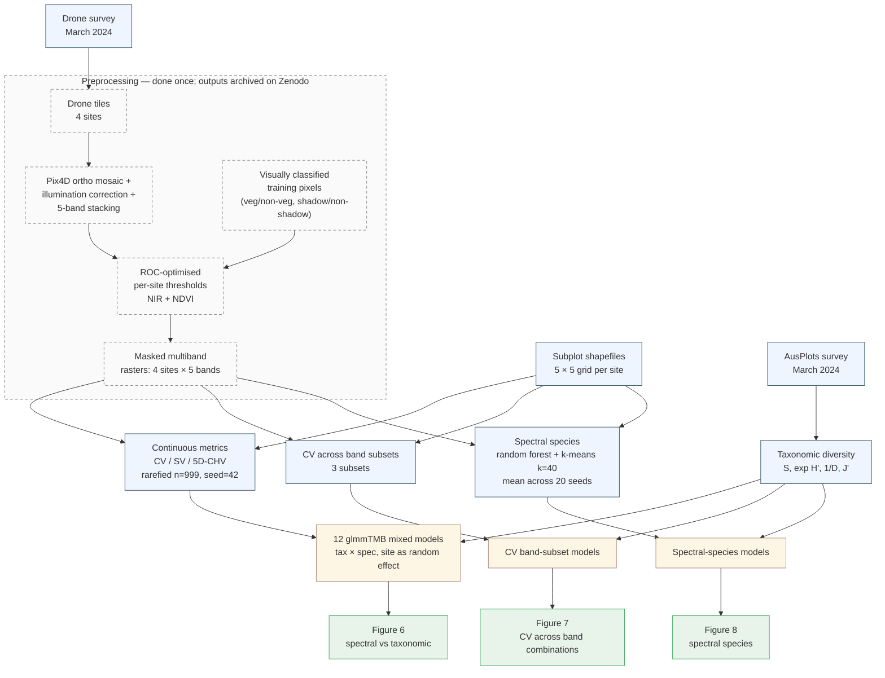

# multispectral_drone_svh

[](https://github.com/adelegem/multispectral_drone_svh/actions/workflows/tests.yml)

Code supporting Gemmell et al., *"Applying the spectral variability hypothesis to arid shrublands, using multispectral drone imagery."*

The analysis tests whether spectral heterogeneity from drone-borne multispectral imagery (5 bands: blue, green, red, red-edge, NIR) predicts taxonomic plant diversity across four AusPlot sites in arid NSW (NSABHC0009–0012), each surveyed as a 5×5 grid of 20 m subplots.

**Data DOI:** [10.5281/zenodo.17089161](https://doi.org/10.5281/zenodo.17089161) (4.4 GB, four masked multiband GeoTIFFs — auto-downloaded on first run).
**Code DOI:** minted at v1.0.0 via Zenodo (forthcoming).

---

## Applying these methods to your own data → use **saltbush**

<a href="https://github.com/traitecoevo/saltbush"></a>

This repository is the **paper-specific application** of a reusable R package called [**saltbush**](https://github.com/traitecoevo/saltbush). saltbush provides the general-purpose spectral-diversity engine — pixel extraction, coefficient of variation, spectral variance, *n*-dimensional convex-hull volume with rarefaction, AusPlots field-diversity calculations. This repo wires saltbush into a `{targets}` pipeline for the specific four-site arid-NSW dataset described in the manuscript.

- **You have your own multispectral imagery and want to compute spectral diversity from it?** → Install [`traitecoevo/saltbush`](https://github.com/traitecoevo/saltbush) (`remotes::install_github("traitecoevo/saltbush")`) and read its vignettes. The functions used here (`calculate_field_diversity()`, `extract_pixel_values()`, `calculate_spectral_metrics()`) are part of saltbush's public API.
- **You want to replicate the specific results in the paper?** → Keep reading.

---

## Reproducing the analysis

The pipeline is driven by [`{targets}`](https://books.ropensci.org/targets/), so reproducing the full analysis is three commands once prerequisites are in place. Two routes:

- **Native R (recommended for users with R already set up).** Steps below.
- **Docker** — a `rocker/geospatial`-based image runs the pipeline end-to-end with no host R configuration. Use this if you'd rather not install R packages locally. See [Docker (alternative)](#docker-alternative) below.

### Prerequisites

| | Version | Notes |
|---|---|---|
| **R** | **4.5.3** (pinned via `renv`) | 4.5.x will work; later versions may need a re-snapshot. |
| **GDAL** | system | macOS: `brew install gdal proj`. Debian/Ubuntu: `apt install libgdal-dev libproj-dev`. |
| **PROJ** | system | as above |
| **C++17 compiler** | system | required by `geometry` (convex-hull volume). On macOS install Xcode CLT (`xcode-select --install`); on Linux any recent g++. |
| **Disk** | ~10 GB free | 4.4 GB for the Zenodo rasters + 2–5 GB for the `_targets/` cache. |
| **Memory** | 8 GB+ recommended | the 5D convex-hull step holds rarefied pixel matrices in memory. |

### 1. Clone and restore the locked R environment

```sh
git clone https://github.com/traitecoevo/multispectral_drone_svh.git
cd multispectral_drone_svh
Rscript -e 'install.packages("renv"); renv::restore()'
```

`renv::restore()` reads `renv.lock` and installs the exact versions used to produce the published results (R 4.5.3, `terra` 1.9-27, `glmmTMB` 1.1.12, `saltbush` at commit `aece6a1`, etc. — see "Pinned dependencies" below for the full list). Expect 15–30 min the first time on a cold cache; under a minute on subsequent restores.

### 2. Run the pipeline

```sh
Rscript -e 'targets::tar_make()'
```

This single command:

1. Downloads the four masked multispectral rasters from Zenodo into `data/raster_images/` if they aren't already there (~4.4 GB, one-time).
2. Builds every target in the DAG — pixel extraction, continuous spectral metrics, 20-seed spectral-species clustering, mixed-model fits, model summaries.

`tar_make()` is incremental: only targets whose inputs have changed are rebuilt. After the first run, re-running it is a no-op (seconds, not hours).

### 3. Inspect results

`tar_make()` also rebuilds `reports/report.html` — a self-contained results document that loads everything via `tar_read()` and renders the workflow figure, Figures 5 and 6, model summary tables, and per-target runtime. **Start there** if you just want to see what the pipeline produced; open it in any browser.

For programmatic access from R:

```r
library(targets)
tar_load(spectral_biodiversity_model_results)   # 12 continuous-metric models
tar_load(cv_biodiversity_model_results)          # CV band-subset models
tar_load(spectral_species_model_results)         # spectral-species models
tar_load(mean_spectral_species)                  # per-subplot spectral diversity
tar_load(spectral_taxonomic_diversity)           # joined metrics + field diversity

tar_visnetwork()   # interactive DAG of the whole pipeline (HTML widget)
```

### Expected runtime

These are the wall-clock numbers from a cold full run on an Apple M-series laptop (2026-05-24). They will dominate any reproduction. After the first run they drop to seconds because `targets` caches every step.

| Stage | Cold runtime | Notes |
|---|---:|---|
| Zenodo raster download | ~30 min | one-time; 4.4 GB |
| Per-site pixel extraction (× 4) | < 2 min | trivially fast |
| CV band-subset metrics (× 3) | ~52 min | one per band combination |
| Continuous spectral metrics (CV/SV/5D-CHV) | **3 h 5 min** | the 5D convex hull dominates |
| Spectral-species clustering (× 20 seeds) | **~40 h** | ~2 h per seed; serial in current config |
| All glmmTMB/lm model fits + summaries | < 1 min | ~100-row data |
| **Full cold-run total** | **~44 h** | see "Faster partial reproduction" if this is too long |

The spectral-species run is the wall-clock bottleneck. Parallelising it across cores via `{crew}` would cut the total to roughly 5 h on the same hardware (one seed per core × 8 cores, since seeds are independent).

### Faster partial reproduction

You don't have to run the full 44 h cold-run to verify the published numbers. From most → least work:

- **Lightweight cache drop-in (~10–15 min)** — the GitHub release attaches `_targets_lite.tar.gz`, a ~2 MB tarball of every cached pipeline output *except* the four raw pixel matrices (too large to distribute). From a fresh clone:

  ```sh
  # 1. Install R dependencies (once, ~15–30 min first time)
  Rscript -e 'renv::restore()'

  # 2. Download and unpack the lightweight cache
  curl -L -o _targets_lite.tar.gz \
    https://github.com/adelegem/multispectral_drone_svh/releases/download/v0.0.1/_targets_lite.tar.gz
  mkdir -p _targets && tar -xzf _targets_lite.tar.gz -C _targets/

  # 3. Run the pipeline — only pixel extraction rebuilds, everything else is cached
  Rscript -e 'targets::tar_make()'
  ```

  That's it. Step 3 downloads the Zenodo rasters (~4.4 GB, one-time), re-extracts the pixel matrices (~10–15 min), and verifies them against the cache. All 80 downstream targets (spectral metrics, 20-seed clustering, model fits, report) are skipped because their inputs haven't changed.

  If something *were* different (a different R version, a modified raster), the pixel hashes wouldn't match and `targets` would automatically invalidate and rebuild everything downstream rather than silently using mismatched results.

- **Just the model results** — same release attaches the model-result RDS files (`spectral_biodiversity_model_results.rds`, etc.) directly. Download them and compare with `digest::digest()` against the digests listed in *Verifying your reproduction* below.

- **Cheap targets only** — `Rscript -e 'targets::tar_make(names = c("taxonomic_diversity", "pixel_values"))'` runs only the fast pieces in a few minutes (no cache needed).

### Docker (alternative)

If you'd rather not install R + GDAL/PROJ + ~200 R packages locally, build the image and run the pipeline in a container instead:

```sh
git clone https://github.com/adelegem/multispectral_drone_svh.git
cd multispectral_drone_svh

# Build the image (~20–30 min on a cold cache; renv::restore() compiles
# or downloads everything in the lockfile).
docker build -t multispectral_drone_svh .

# Run the pipeline. Bind-mount these host directories so the heavy bits
# (Zenodo rasters, _targets/ cache, rendered report) persist between runs
# rather than being thrown away with the container.
docker run --rm \
  -v "$(pwd)/data:/workspace/data" \
  -v "$(pwd)/_targets:/workspace/_targets" \
  -v "$(pwd)/reports:/workspace/reports" \
  multispectral_drone_svh
```

What this gives you:

- **Pinned R + system deps**, including GDAL/PROJ/GEOS/UDUNITS, the saltbush GitHub commit, and every package in `renv.lock`. Nothing on your host R install (if you have one) is touched.
- **Reproducibility by construction.** The `FROM rocker/geospatial:4.5.3` line pins the same R version captured in the lockfile, so the build is bit-for-bit reproducible against the published numbers.

Override the default command to drop into an interactive R session:

```sh
docker run --rm -it \
  -v "$(pwd)/data:/workspace/data" \
  -v "$(pwd)/_targets:/workspace/_targets" \
  multispectral_drone_svh R
```

If you hit GitHub rate limits while `renv::restore()` is pulling saltbush from `traitecoevo/saltbush`, pass a PAT at build time:

```sh
docker build --build-arg GITHUB_PAT=$(gh auth token) -t multispectral_drone_svh .
```

---

## Tests

The repo ships with a tiered test suite that doesn't require the rasters:

```sh
Rscript -e 'testthat::test_dir("tests")'                  # Tier 1, ~10 s, every change
RUN_TIER2=true Rscript -e 'testthat::test_dir("tests")'   # Tier 2, ~minutes, needs rasters
```

Tier 1 snapshots the taxonomic-diversity output against `tests/fixtures/taxonomic_diversity_baseline.rds`. Tier 2 additionally exercises pixel extraction and spectral metrics on the smallest raster (NSABHC0010, 554 MB). A GitHub Actions workflow ([`.github/workflows/tests.yml`](.github/workflows/tests.yml)) runs Tier 1 on every push to `main` and on pull requests against `main`, exercising the locked `renv` environment on `ubuntu-latest`.

---

## Workflow



The dashed block is upstream of this repo: the rasters arrive pre-masked from Zenodo, so `tar_make()` covers only the steps below the dashed block. The scripts that produced the Zenodo-archived rasters live in [`preprocessing/`](preprocessing/) for transparency — they're **not** invoked by `tar_make()` and aren't needed to reproduce the analysis. See `preprocessing/README.md` for what they do and what inputs they need.

For the full live DAG (84 targets including the per-site and per-pair fan-out), run `targets::tar_visnetwork()` after `tar_make()`. For a static export to embed elsewhere, `targets::tar_mermaid()`.

---

## Why `{targets}`

Two scripts would work — earlier versions of this repo had exactly that. We adopted `{targets}` once the analysis crossed three thresholds at once:

1. **Cumulative wall-clock crossed a day.** A single full cold run takes ~44 h. Without caching, any change anywhere meant restarting from scratch. With `{targets}`, only the affected downstream branches re-run when an input changes — usually a few minutes.
2. **The analysis is naturally a cross-product.** `site × taxonomic-metric × spectral-metric × band-subset × seed` produces hundreds of intermediate targets. `tar_map()` / `tar_map_rep()` express that declaratively in tens of lines; nested `for` loops would have been hundreds.
3. **Reproducibility needs to be load-bearing, not aspirational.** `targets` hashes every input and function. If an intermediate changes value, downstream invalidates automatically — there's no way to silently end up with model results that don't match the rasters they're supposed to come from.

For analyses with these properties — multi-hour, multi-input, cross-product — a Make-style DAG with content-addressed caching is the smallest tool that delivers "re-run only what changed". For analyses that fit in a single fast script, it would be over-engineering. This analysis didn't.

---

## Reproducibility notes

- **Rarefaction seed.** `RAREFACTION_SEED = 42` (declared at the top of `_targets.R`) is threaded into every rarefied call. CV / SV / 5D-CHV are bit-exact reproducible across runs.
- **Spectral-species seeds.** Clustering is repeated over `seeds = 1:20`. Per-seed results are persisted and averaged. Each seed's RF+k-means is deterministic given its seed.
- **Singular-fit refit convention.** The three `pielou_evenness × {CV, SV, log CHV}` mixed models consistently produce site random-intercept σ ≈ 0 (singular). The pipeline auto-refits these as fixed-effect linear models and marks the row with `model_kind = "fixed"` in the results tables. All other models stay as `glmmTMB` mixed.
- **Determinism caveat.** Output is bit-exact only on R 4.5.3 with the locked package set. Different R minor versions or `glmmTMB`/`terra` versions may produce numerically tiny differences in the third decimal place of model coefficients without changing inference.

### Verifying your reproduction

After a successful `tar_make()`, compare your local digests against the canonical ones below. Run the helper:

```sh
Rscript tools/checksums.R
```

…and check the printed digests match these (MD5 via `digest::digest()`):

**Pipeline outputs**

| target | digest |
|---|---|
| `taxonomic_diversity`                     | `2e7ab997590ecf3815febc91f16218da` |
| `spectral_taxonomic_diversity`            | `c8213378aeb5f9d09f713061b3e6cdb3` |
| `mean_spectral_species`                   | `b77a5a151d22a185bd992e1743e8e4a0` |
| `spectral_biodiversity_model_results`     | `645e3de7e2209936419b581b858c2045` |
| `cv_biodiversity_model_results`           | `85eb9f299293041be936f9257e80369c` |
| `spectral_species_model_results`          | `1538b5ae784988c79d98868b4bea18e5` |

**Test fixtures** (tracked in `tests/fixtures/`)

| file | digest |
|---|---|
| `pixel_summary_baseline_NSABHC0010.rds`    | `5c972218a21c86e314badd6ccf695246` |
| `spectral_metrics_baseline_NSABHC0010.rds` | `34ca5eb65f9c4e7288b993fce7073a07` |
| `taxonomic_diversity_baseline.rds`         | `2e7ab997590ecf3815febc91f16218da` |

Bit-exact matches depend on the locked `renv` environment (R 4.5.3 + the lockfile). Different R minor versions or unlocked `glmmTMB` / `terra` versions can produce numerically tiny differences without changing inference — see *Reproducibility notes* above for the determinism caveat. If your digests differ, eyeball the actual values too (use `tar_read()` and compare against the figures in `reports/report.html`) before concluding something is broken.

---

## Pinned dependencies

Full list from `renv.lock`. Run `renv::restore()` to install all of these at the exact versions below.

- **Spatial** — `sf` 1.1-1, `terra` 1.9-27
- **Modelling** — `glmmTMB` 1.1.12, `performance` 0.15.0, `vegan` 2.7-3, `geometry` 0.5.2
- **Clustering** — `randomForest` 4.7-1.2, `cluster` 2.1.8.2
- **Pipeline** — `targets` 1.12.0, `tarchetypes` 0.14.1
- **Figures** — `ggnewscale` 0.5.2, `ggh4x` 0.3.1, `ggraph` 2.2.2, `tidygraph` 1.3.1
- **Tidyverse** — `tidyverse` 2.0.0, `data.table` 1.18.4
- **Tests** — `testthat` 3.2.3, `waldo` 0.6.2
- **Mask thresholding** — `pROC` 1.19.0.1
- **Project-specific** — `saltbush` from GitHub `traitecoevo/saltbush@aece6a1`

---

## License

- **Source code:** [MIT](LICENSE).
- **Data files** shipped under `data/` and the rasters auto-downloaded from Zenodo: [CC-BY-4.0](https://creativecommons.org/licenses/by/4.0/), matching the Zenodo deposit.

## Citation

If you use this code or data, please cite both. Structured metadata in [`CITATION.cff`](CITATION.cff). The dataset DOI is [10.5281/zenodo.17089161](https://doi.org/10.5281/zenodo.17089161); the code DOI will be added on v1.0.0 release.

---

## For maintainers / contributors

Codebase conventions, phase plan, and the breakdown of `funx.R` vs `saltbush` delegation live in [`CLAUDE.md`](CLAUDE.md). The canonical current-results document is [`reports/report.html`](reports/report.html), regenerated by `tar_render()` whenever upstream targets change.
