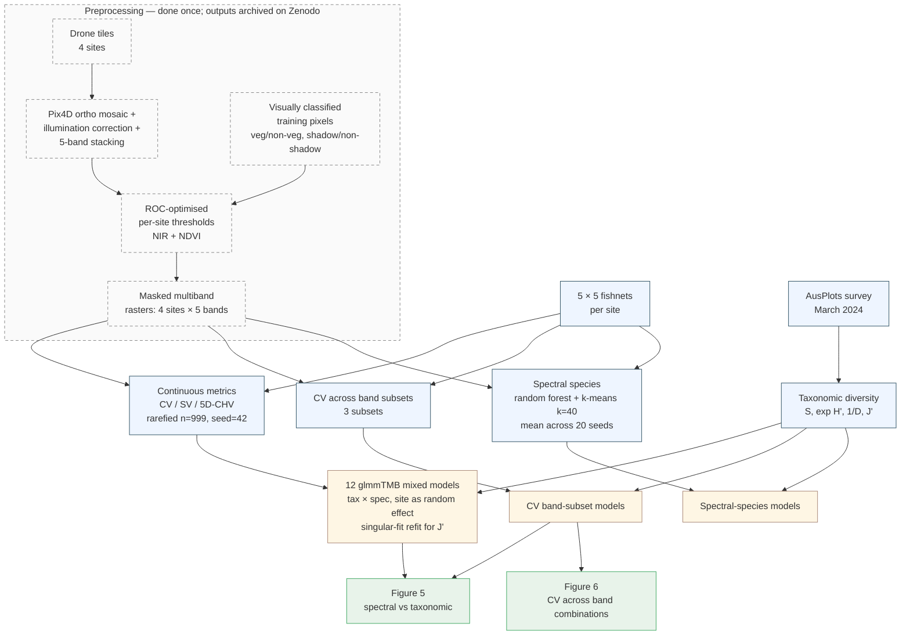

# multispectral_drone_svh

Code supporting Gemmell et al., *"Applying the spectral variability hypothesis to arid shrublands, using multispectral drone imagery."*

The analysis tests whether spectral heterogeneity from drone-borne multispectral imagery (5 bands: blue, green, red, red-edge, NIR) predicts taxonomic plant diversity across four AusPlot sites in arid NSW (NSABHC0009–0012), each surveyed as a 5×5 grid of 20 m subplots.

**Data DOI:** [10.5281/zenodo.17089161](https://doi.org/10.5281/zenodo.17089161) (4.4 GB, four masked multiband GeoTIFFs — auto-downloaded on first run).
**Code DOI:** minted at v1.0.0 via Zenodo (forthcoming).

---

## Reproducing the analysis

The pipeline is driven by [`{targets}`](https://books.ropensci.org/targets/), so reproducing the full analysis is three commands once prerequisites are in place. Two routes:

- **Native R (recommended for users with R already set up).** Steps below.
- **Docker** (forthcoming in v1.0.0): a `rocker/geospatial`-based image will provide GDAL/PROJ pre-installed and run the pipeline end-to-end with no host R configuration. Use this if you'd rather not install R packages locally.

### Prerequisites

| | Version | Notes |
|---|---|---|
| **R** | **4.5.3** (pinned via `renv`) | 4.5.x will work; later versions may need a re-snapshot. |
| **GDAL** | system | macOS: `brew install gdal proj`. Debian/Ubuntu: `apt install libgdal-dev libproj-dev`. |
| **PROJ** | system | as above |
| **C++17 compiler** | system | required by `geometry` (convex-hull volume). On macOS install Xcode CLT (`xcode-select --install`); on Linux any recent g++. |
| **Disk** | ~10 GB free | 4.4 GB for the Zenodo rasters + 2–5 GB for the `_targets/` cache. |
| **Memory** | 8 GB+ recommended | the 5D convex-hull step holds rarefied pixel matrices in memory. |

### 1. Clone and restore the locked R environment

```sh
git clone https://github.com/traitecoevo/multispectral_drone_svh.git
cd multispectral_drone_svh
Rscript -e 'install.packages("renv"); renv::restore()'
```

`renv::restore()` reads `renv.lock` and installs the exact versions used to produce the published results (R 4.5.3, `terra` 1.9-27, `glmmTMB` 1.1.12, `saltbush` at commit `aece6a1`, etc. — see "Pinned dependencies" below for the full list). Expect 15–30 min the first time on a cold cache; under a minute on subsequent restores.

### 2. Run the pipeline

```sh
Rscript -e 'targets::tar_make()'
```

This single command:

1. Downloads the four masked multispectral rasters from Zenodo into `data/raster_images/` if they aren't already there (~4.4 GB, one-time).
2. Builds every target in the DAG — pixel extraction, continuous spectral metrics, 20-seed spectral-species clustering, mixed-model fits, model summaries.

`tar_make()` is incremental: only targets whose inputs have changed are rebuilt. After the first run, re-running it is a no-op (seconds, not hours).

### 3. Inspect results

```r
library(targets)
tar_load(spectral_biodiversity_model_results)   # 12 continuous-metric models
tar_load(cv_biodiversity_model_results)          # CV band-subset models
tar_load(spectral_species_model_results)         # spectral-species models
tar_load(mean_spectral_species)                  # per-subplot spectral diversity
tar_load(spectral_taxonomic_diversity)           # joined metrics + field diversity

tar_visnetwork()   # interactive DAG of the whole pipeline (HTML widget)
```

### Expected runtime

These are the wall-clock numbers from a cold full run on an Apple M-series laptop (2026-05-24). They will dominate any reproduction. After the first run they drop to seconds because `targets` caches every step.

| Stage | Cold runtime | Notes |
|---|---:|---|
| Zenodo raster download | ~30 min | one-time; 4.4 GB |
| Per-site pixel extraction (× 4) | < 2 min | trivially fast |
| CV band-subset metrics (× 3) | ~52 min | one per band combination |
| Continuous spectral metrics (CV/SV/5D-CHV) | **3 h 5 min** | the 5D convex hull dominates |
| Spectral-species clustering (× 20 seeds) | **~40 h** | ~2 h per seed; serial in current config |
| All glmmTMB/lm model fits + summaries | < 1 min | ~100-row data |
| **Full cold-run total** | **~44 h** | see "Faster partial reproduction" if this is too long |

The spectral-species run is the wall-clock bottleneck. Parallelising it across cores via `{crew}` would cut the total to roughly 5 h on the same hardware (one seed per core × 8 cores, since seeds are independent).

### Faster partial reproduction

You don't have to run the full 44 h cold-run to verify the published numbers. From most → least work:

- **Cached `_targets/`:** if you obtain the project's `_targets/` cache (release artifact attached to the GitHub release, forthcoming in v1.0.0), drop it into the project root and `tar_make()` will skip every cached step. Expect minutes, not hours.
- **Just the model results:** the v1.0.0 release will include the model-result RDS files (`spectral_biodiversity_model_results.rds`, etc.) as attached assets. Download them and compare with `digest::digest()` against your own run.
- **Cheap targets only:** `Rscript -e 'targets::tar_make(callr_function = NULL, names = c("taxonomic_diversity", "pixel_values"))'` runs only the fast pieces (under a minute).

---

## Tests

The repo ships with a tiered test suite that doesn't require the rasters:

```sh
Rscript -e 'testthat::test_dir("tests")'                  # Tier 1, ~10 s, every change
RUN_TIER2=true Rscript -e 'testthat::test_dir("tests")'   # Tier 2, ~minutes, needs rasters
```

Tier 1 snapshots the taxonomic-diversity output against `tests/fixtures/taxonomic_diversity_baseline.rds`. Tier 2 additionally exercises pixel extraction and spectral metrics on the smallest raster (NSABHC0010, 554 MB). A continuous-integration job runs Tier 1 on every push (see `.github/workflows/`, forthcoming).

---

## Workflow



The dashed block is upstream of this repo: the rasters arrive pre-masked from Zenodo. `tar_make()` covers everything below the dashed block.

For the full live DAG (84 targets including the per-site and per-pair fan-out), run `targets::tar_visnetwork()` after `tar_make()`. For a static export to embed elsewhere, `targets::tar_mermaid()`.

---

## Why `{targets}`

Two scripts would work — earlier versions of this repo had exactly that. We adopted `{targets}` once the analysis crossed three thresholds at once:

1. **Cumulative wall-clock crossed a day.** A single full cold run takes ~44 h. Without caching, any change anywhere meant restarting from scratch. With `{targets}`, only the affected downstream branches re-run when an input changes — usually a few minutes.
2. **The analysis is naturally a cross-product.** `site × taxonomic-metric × spectral-metric × band-subset × seed` produces hundreds of intermediate targets. `tar_map()` / `tar_map_rep()` express that declaratively in tens of lines; nested `for` loops would have been hundreds.
3. **Reproducibility needs to be load-bearing, not aspirational.** `targets` hashes every input and function. If an intermediate changes value, downstream invalidates automatically — there's no way to silently end up with model results that don't match the rasters they're supposed to come from.

For analyses with these properties — multi-hour, multi-input, cross-product — a Make-style DAG with content-addressed caching is the smallest tool that delivers "re-run only what changed". For analyses that fit in a single fast script, it would be over-engineering. This analysis didn't.

---

## Reproducibility notes

- **Rarefaction seed.** `RAREFACTION_SEED = 42` (declared at the top of `_targets.R`) is threaded into every rarefied call. CV / SV / 5D-CHV are bit-exact reproducible across runs.
- **Spectral-species seeds.** Clustering is repeated over `seeds = 1:20`. Per-seed results are persisted and averaged. Each seed's RF+k-means is deterministic given its seed.
- **Singular-fit refit convention.** The three `pielou_evenness × {CV, SV, log CHV}` mixed models consistently produce site random-intercept σ ≈ 0 (singular). The pipeline auto-refits these as fixed-effect linear models and marks the row with `model_kind = "fixed"` in the results tables. All other models stay as `glmmTMB` mixed.
- **Determinism caveat.** Output is bit-exact only on R 4.5.3 with the locked package set. Different R minor versions or `glmmTMB`/`terra` versions may produce numerically tiny differences in the third decimal place of model coefficients without changing inference.

### Verifying your reproduction

```r
digest::digest(tar_read(spectral_biodiversity_model_results))
```

Compare against the digest published in the v1.0.0 release notes (forthcoming).

---

## Pinned dependencies

Full list from `renv.lock`. Run `renv::restore()` to install all of these at the exact versions below.

- **Spatial** — `sf` 1.1-1, `terra` 1.9-27
- **Modelling** — `glmmTMB` 1.1.12, `performance` 0.15.0, `vegan` 2.7-3, `geometry` 0.5.2
- **Clustering** — `randomForest` 4.7-1.2, `cluster` 2.1.8.2
- **Pipeline** — `targets` 1.12.0, `tarchetypes` 0.14.1
- **Figures** — `ggnewscale` 0.5.2, `ggh4x` 0.3.1, `ggraph` 2.2.2, `tidygraph` 1.3.1
- **Tidyverse** — `tidyverse` 2.0.0, `data.table` 1.18.4
- **Tests** — `testthat` 3.2.3, `waldo` 0.6.2
- **Mask thresholding** — `pROC` 1.19.0.1
- **Project-specific** — `saltbush` from GitHub `traitecoevo/saltbush@aece6a1`

---

## License

- **Source code:** [MIT](LICENSE).
- **Data files** shipped under `data/` and the rasters auto-downloaded from Zenodo: [CC-BY-4.0](https://creativecommons.org/licenses/by/4.0/), matching the Zenodo deposit.

## Citation

If you use this code or data, please cite both. Structured metadata in [`CITATION.cff`](CITATION.cff). The dataset DOI is [10.5281/zenodo.17089161](https://doi.org/10.5281/zenodo.17089161); the code DOI will be added on v1.0.0 release.

---

## For maintainers / contributors

Codebase conventions, phase plan, and the breakdown of `funx.R` vs `saltbush` delegation live in [`CLAUDE.md`](CLAUDE.md). Day-to-day analysis state — which scripts have been run, current model decisions awaiting review — lives in [`reports/interim_progress.Rmd`](reports/interim_progress.Rmd).
