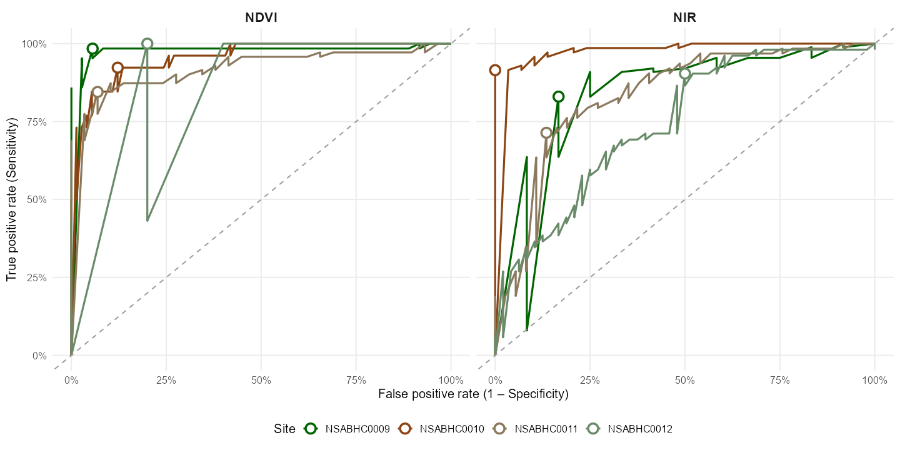

# `preprocessing/`

Documenting how the raw drone outputs were turned into the masked multispectral rasters archived on Zenodo ([10.5281/zenodo.17089161](https://doi.org/10.5281/zenodo.17089161)). **Not part of the main `{targets}` pipeline** — these scripts run *upstream* of the analysis and only need to be re-run if the raw drone tiles or training data change.

Anyone reproducing the analysis downloads the masked rasters directly via `download_zenodo_rasters()` and skips this stage entirely — see the top-level [README](../README.md)'s *Reproducing the analysis* section.

## Why is this separate from `tar_make()`?

The masked rasters are the *input* to the analysis pipeline. They're produced once per dataset and archived publicly. These scripts exist for **transparency**: they document every step from raw drone tiles to Zenodo-archived rasters so reviewers can inspect the full chain.

## Three-stage pipeline

### Stage 1 — Band stacking *(raw data not in repo)*

**Inputs:** Per-band GeoTIFFs output by Pix4D (one per band per site, 5 bands: blue, green, red, red-edge, NIR), plus a pre-step illumination correction applied within Pix4D. The raw drone tiles and Pix4D outputs are large and project-specific; contact the authors if you need access for independent verification.

**Process:** Stack the 5 per-band GeoTIFFs for each site into a single multiband GeoTIFF in wavelength order using `funx.R::create_multiband_image()`.

**Output:** One 5-band GeoTIFF per site.

No script is provided for this step — it cannot be run without the raw Pix4D outputs.

---

### Stage 2 — ROC threshold selection *(fully reproducible)*

**Script:** [`02_roc_thresholds.R`](02_roc_thresholds.R)

**Inputs** (tracked in this repo):
- `data/ndvi_reference_point_values.csv` — 100 visually classified points per site (veg | non-veg)
- `data/nir_reference_point_values.csv` — 100 visually classified points per site (shadow | non-shadow)

**Process:** Fits ROC curves using the Youden index to find the optimal per-site threshold for separating vegetation from bare ground (NDVI) and non-shadow from shadow (NIR). A Red band filter exists in `saltbush` but was deliberately not applied to this dataset.

**Outputs:**
- `data_out/ndvi_thresholds_2024.csv` — threshold + AUC + sensitivity/specificity per site
- `data_out/nir_thresholds.csv`
- `preprocessing/roc_curves.png` — ROC curves for all sites × both metrics (tracked; also saved to `maps_graphs/`)

```sh
# Run from the project root:
Rscript preprocessing/02_roc_thresholds.R
```

Site-specific thresholds and ROC diagnostics at the Youden-optimal cut-point:

| Site | Metric | Threshold | AUC | Sensitivity | Specificity |
|---|---|---|---|---|---|
| NSABHC0009 | NDVI | 0.02198 | 0.981 | 0.984 | 0.944 |
| NSABHC0010 | NDVI | 0.02310 | 0.956 | 0.923 | 0.878 |
| NSABHC0011 | NDVI | 0.06775 | 0.924 | 0.845 | 0.931 |
| NSABHC0012 | NDVI | 0.04794 | 0.886 | 1.000 | 0.800 |
| NSABHC0009 | NIR | 0.03323 | 0.838 | 0.830 | 0.833 |
| NSABHC0010 | NIR | 0.05510 | 0.985 | 0.915 | 1.000 |
| NSABHC0011 | NIR | 0.04225 | 0.834 | 0.714 | 0.865 |
| NSABHC0012 | NIR | 0.03722 | 0.744 | 0.904 | 0.500 |



---

### Stage 3 — Apply mask *(raw data not in repo)*

**Inputs:** 5-band GeoTIFFs from Stage 1 + per-site thresholds from Stage 2.

**Process:** Applies the NDVI and NIR thresholds via `funx.R::create_masked_raster()` to zero out bare ground and shadow pixels, producing the final masked rasters.

**Output:** `NSABHC00{09..12}_masked.tif` — the four files archived on Zenodo and downloaded by `tar_make()`.

No script is provided for this step — it cannot be run without the Stage 1 outputs. The masked images are archived on Zenodo ([10.5281/zenodo.17089161](https://doi.org/10.5281/zenodo.17089161)).

---

## Inputs not in this repo

- Per-site raw drone tiles
- Pix4D per-band GeoTIFFs
- Stage 1 multiband GeoTIFFs

Contact the authors if you need access to these for independent verification.
